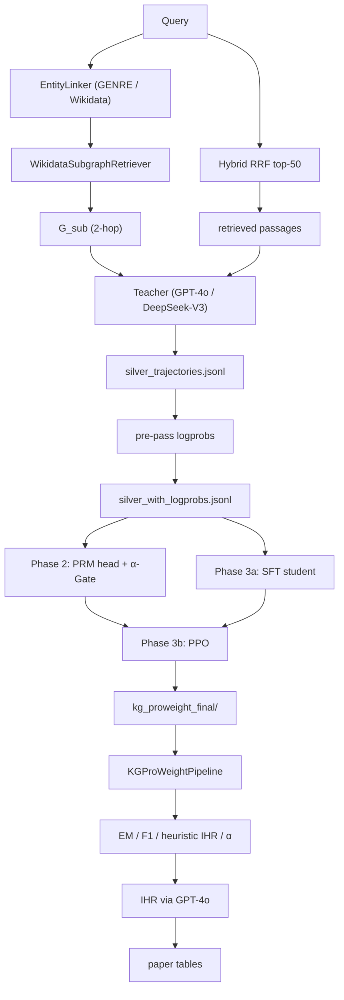

# Architecture Overview

This document describes the module layout and primary dataflow of
`kgproweight`. For the methodology, see [`paper_design.md`](paper_design.md).

---

## 1. Package layout

```mermaid
flowchart LR
    subgraph utils[kgproweight.utils]
        paths
        seed
        logging
        flashrag_bootstrap
    end

    subgraph config[kgproweight.config]
        loader
        schemas
    end

    subgraph kg[kgproweight.kg]
        entity_linker
        wikidata_retriever
        kg_embeddings
        coverage
        cache
    end

    subgraph reward[kgproweight.reward]
        alpha_gate
        prm_annotator
        prm_value_head
        text_reward_model
        composite_reward
        ihr_judge
    end

    subgraph data[kgproweight.data]
        prompts
        silver_dataset
        d_dropout_loader
        parsers
        flashrag_loader
    end

    subgraph retrieval[kgproweight.retrieval]
        hybrid
        bootstrap
    end

    subgraph pipeline[kgproweight.pipeline]
        kg_proweight_pipeline
        no_kg_pipeline
        generators
    end

    subgraph training[kgproweight.training]
        phase1_distill
        phase2_prm
        phase3_sft
        phase3_ppo
        phase3_grpo
        reward_function
    end

    subgraph eval[kgproweight.eval]
        runner
        baselines
        metrics
        alpha_analysis
        stats
        data_efficiency
        variance_validation
    end

    config --> utils
    kg --> utils
    reward --> kg
    reward --> data
    data --> utils
    retrieval --> utils
    pipeline --> retrieval
    pipeline --> reward
    pipeline --> data
    training --> reward
    training --> data
    training --> retrieval
    eval --> pipeline
    eval --> training
```

---

## 2. End-to-end dataflow

---

## 3. Module responsibilities

### kgproweight.utils

- `paths.py` — `project_root()`, `data_dir()`, `index_dir()`,
  `checkpoint_dir()`, `output_dir()` resolved from `KGPW_*` env vars or
  pyproject defaults. **Only place where paths are constructed.**
- `logging.py` — rich-console + file handler factory.
- `seed.py` — `set_seed(int)` covers numpy/random/torch/transformers.
- `flashrag_bootstrap.py` — **only place** that injects FlashRAG into
  `sys.path` if it is not pip-installed.

### kgproweight.config

- `loader.py` — `load_config(path, overrides)` merges YAML files, env vars,
  and dict overrides into a single pydantic model.
- `schemas.py` — `RetrievalConfig`, `TrainingConfig`, `RewardConfig`,
  `EvalConfig`, `ProjectConfig`.

### kgproweight.kg

- `entity_linker.py` — primary path uses GENRE if available; falls back to
  Wikidata Search API. Cache backed by `cache.py`.
- `wikidata_retriever.py` — 2-hop SPARQL retriever with disk cache.
- `kg_embeddings.py` — optional TransE/RotatE loader for `link_confidence`.
- `coverage.py`, `cache.py` — shared helpers.

### kgproweight.reward

- `alpha_gate.py` — 3-feature gate. The 3rd feature accepts both pre-computed
  logprobs (training time) and runtime logprobs (inference time).
- `prm_annotator.py` — three-class step labelling with the spurious-entity
  filter from kg2 preserved.
- `prm_value_head.py` — MLP head used by the PPO critic.
- `text_reward_model.py` — ReaRAG-9B prompt scorer (primary) or a
  Llama-3-8B + linear head fallback.
- `composite_reward.py` — `R_total = α·R_KG + (1-α)·R_Text` with R_Text
  actually consumed; returns per-step tensors for GAE.
- `ihr_judge.py` — GPT-4o LLM-as-Judge + Cohen κ helper.

### kgproweight.data

- `prompts.py` — **the** canonical prompt schema. Every Teacher / SFT /
  RL / inference call uses the same `[Step N]` format.
- `silver_dataset.py` — torch Dataset producing tokenised steps + logprobs.
- `d_dropout_loader.py` — yields items whose `kg_subgraph` is the
  severed-noise version when present.
- `parsers.py` — robust `[Step N]` and `[Final Answer]` extraction.
- `flashrag_loader.py` — `get_dataset(config)` thin wrapper.

### kgproweight.retrieval

- `hybrid.py` — `build_rrf_setting(corpus, bm25_index, e5_path)` produces
  the FlashRAG `multi_retriever_setting` dict (top-50, k=60). Used by both
  Phase 1 and every evaluation runner.
- `bootstrap.py` — `resolve_bm25_index_path()` and other path resolutions.

### kgproweight.pipeline

- `kg_proweight_pipeline.py` — subclass of FlashRAG's `ReasoningPipeline`.
  Reads `metadata.dropout.modified_kg` if present (D_dropout); otherwise
  calls SPARQL. Records α + heuristic IHR.
- `no_kg_pipeline.py` — bypasses KG injection for the `no_kg` ablation.
- `generators.py` — `build_generator(config, lora_path, dtype="bf16")`
  with optional 4-bit fallback.

### kgproweight.training

- `phase1_distill.py` — orchestrates Phase 1 (entity linking → SPARQL →
  retrieval → Teacher → PRM annotation → filter).
- `phase2_prm.py` — trains the LoRA + PRM head + α-Gate.
- `phase3_sft.py` — supervised fine-tuning of the student on filtered
  silver trajectories.
- `phase3_ppo.py` — PPO + GAE + critic + reference model + per-token
  reward. Default on Pro 6000.
- `phase3_grpo.py` — single-model GRPO fallback.
- `reward_function.py` — `KGProWeightRewardFunction` shared by GRPO/PPO.

### kgproweight.eval

- `runner.py` — generic `run_eval(config, pipeline_factory)` used by all
  CLI runners.
- `baselines.py` — declarative baseline registry under a shared retrieval
  config.
- `metrics.py` — EM / F1 / heuristic IHR aggregator.
- `alpha_analysis.py` — D_std vs D_dropout comparison.
- `stats.py` — paired bootstrap CI + paired t-test.
- `data_efficiency.py` — multi-size training & evaluation harness.
- `variance_validation.py` — logs advantage variance under fixed vs
  dynamic α (theorem 2).

---

## 4. Naming conventions

- Modules use snake_case; classes use PascalCase.
- Public reward symbols mirror the paper: `R_kg`, `R_text`, `R_total`,
  `R_outcome`, `alpha_t`, `gamma`, `lam`.
- Every checkpoint directory holds a `manifest.json` with seed, deps, and
  git commit hash, generated by `kgproweight.utils.logging.dump_manifest()`.
