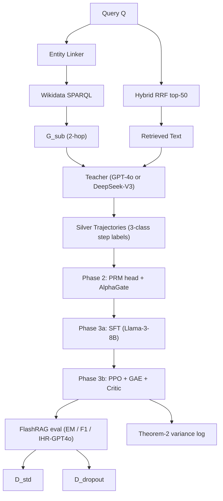

# KG-ProWeight: Adaptive Process Supervision for Agentic RAG

> 基于知识图谱约束蒸馏与动态可信度权重的 Agentic RAG 自适应过程监督方法。

This document is the canonical methodology specification for KG-ProWeight. It
is a faithful Markdown port of the original `KG-ProWeight_paper_design.txt`
(version 1.0, 2026-05-08), with hyperlinks and code references added so it can
serve as both the paper outline and the implementation source-of-truth.

---

## Contents

1. [Abstract](#1-abstract)
2. [Introduction](#2-introduction)
3. [Related Work](#3-related-work)
4. [Methodology](#4-methodology)
   - 4.1 Phase 1 — Graph-Guided Trajectory Distillation
   - 4.2 Phase 2 — Dynamic Confidence Gating (α-Gate)
   - 4.3 Phase 3 — Adaptive Process-Supervised RL
5. [Experimental Design](#5-experimental-design)
6. [Theoretical Analysis](#6-theoretical-analysis)
7. [Ablation Studies](#7-ablation-studies)
8. [Limitations & Future Work](#8-limitations--future-work)
9. [Appendix A — FlashRAG configuration](#appendix-a-flashrag-configuration)
10. [Appendix B — Teacher prompt template](#appendix-b-teacher-prompt-template)
11. [Appendix C — TRL PPO recipe](#appendix-c-trl-ppo-recipe)

---

## 1. Abstract

Large Language Models (LLMs) achieve strong multi-hop reasoning in Agentic
RAG, but their dependence on dense process-reward labels and the prevalence of
"reasoning hallucinations" hinder deployment. Existing text-only process
supervisors (e.g., ReaRAG, R1-Searcher) lift the coherence of generated
trajectories but lack an explicit factuality anchor at every step, allowing
silently fabricated relations to slip through.

**KG-ProWeight** addresses both pain points by leveraging an external
knowledge graph (Wikidata) as a logical anchor: it auto-constructs
fine-grained process-reward labels by topological verification, and uses a
learned confidence gate to mix KG and text rewards adaptively.

Contributions:

1. **Graph-Guided Trajectory Distillation** — a structured-constraint prompt
   plus Wikidata reachability check distills three-valued step labels
   (+1 / 0 / −1) from Teacher LLMs (GPT-4o or DeepSeek-V3) at near-zero
   annotation cost while preserving factual traceability.
2. **Dynamic Confidence Gating (α-Gate)** — a 3-feature learnable gate
   (graph density, link confidence, semantic uncertainty) mixes the KG and
   text process rewards per-step; high density and confidence push α→1
   (enforce KG), absence pushes α→0 (fall back to text).
3. **Adaptive Process-Supervised RL** — PPO with GAE on composite per-step
   rewards trains the student (Llama-3-8B-Instruct) under the gate's
   adaptive blend.

On HotpotQA / 2WikiMultiHopQA / MuSiQue, KG-ProWeight surpasses ReaRAG by
2–4 F1 points using only 30–40 % of the trajectory data and reduces
intermediate hallucination rate (IHR) by 15–25 % — while the dynamic α
mechanism degrades gracefully on a held-out **D_dropout** robustness set.

---

## 2. Introduction

### 2.1 Motivation

Multi-hop QA requires that the model chain evidence across many retrieval
steps. Agentic RAG extends classical RAG with iterative search and answer
refinement and achieves strong scores on HotpotQA and MuSiQue.

Two open challenges remain:

- **C1 — Scarce process-supervision data.** ReaRAG and R1-Searcher require
  expensive per-step annotations to train their PRMs; this does not scale to
  new domains.
- **C2 — KG incompleteness.** Using KG triple consistency *directly* as the
  process reward causes false negatives wherever Wikidata is sparse (recent
  events, long-tail entities, domain-specific facts), which in turn injects
  contradictory gradients into PPO and slows convergence.

### 2.2 Contributions

- An automated PRM data-construction procedure that returns three-valued
  step labels (positive / neutral / negative) with effectively zero human
  cost.
- A learnable confidence gate that proves to reduce the variance of the PPO
  advantage estimator (see §6.2).
- A unified evaluation under FlashRAG, including a new
  *Knowledge-Dropout* benchmark `D_dropout` that quantitatively probes the
  gate's graceful-fallback behaviour.

---

## 3. Related Work

### 3.1 Agentic RAG and multi-hop reasoning

IRCoT [Trivedi 2022] interleaves retrieval and CoT; ReAct [Yao 2023] adds
action calls; Self-RAG [Asai 2024] introduces reflection tokens; Search-R1
[Jin 2025] and R1-Searcher [Song 2025] use outcome-only RL; **ReaRAG**
[Cheng 2025] is the closest text-only competitor.

### 3.2 Process reward models

[Lightman 2023] established PRM > ORM on math; OmegaPRM [Liao 2024] reduces
the labelling burden via MCTS, but is unverified on open-domain QA. KG-ProWeight
replaces manual labels with KG topology verification at the per-step level.

### 3.3 KG-augmented LLMs

Three lines exist: (a) input-augmentation (KAPING [Baek 2023]),
(b) structure-aware encoders (KGRAG, SubgraphRAG), and (c) *process-time*
constraints (Trace / KGTraceRefiner, integrated in FlashRAG). KG-ProWeight is
the first to push KG constraints into the *training-time process reward*.

### 3.4 Knowledge distillation and silver labels

Symbolic Knowledge Distillation [West 2022] and "LLM-as-teacher" recipes
[Ho 2023] established silver-data pipelines. We are the first to combine
trajectory distillation with KG topology verification for PRM construction.

---

## 4. Methodology

KG-ProWeight has three sequential phases:



### 4.1 Phase 1 — Graph-Guided Trajectory Distillation

#### Step 1.1 — Subgraph anchoring

Extract a query entity set `E_Q` with an entity linker (GENRE as primary,
Wikidata Search as fallback). For each linked entity `e_i`, fetch the
2-hop neighbourhood from the Wikidata SPARQL endpoint with `K_e = 30`
neighbours per entity. Discard entities below confidence 0.6 and the entire
query if `coverage(Q) < 0.5`.

Implementation: [`kgproweight/kg/wikidata_retriever.py`](../kgproweight/kg/wikidata_retriever.py).

#### Step 1.2 — Constrained chain-of-thought generation

The Teacher receives `(Q, retrieved passages, G_sub)` and is prompted to
generate per-step text with explicit triple citations:

```
[Step N]
Reasoning: <text>
Knowledge Used: [(entity1, relation, entity2), ...]
Conclusion: <fact derived>
```

Implementation: [`kgproweight/data/prompts.py`](../kgproweight/data/prompts.py).

#### Step 1.3 — Three-valued automatic PRM annotation

- `+1` if every cited triple is verified in `G_sub` **and** the step is
  consistent with prior step conclusions.
- ` 0` if the step makes no falsifiable factual claim (transitional /
  decompositional).
- `-1` on a hallucinated triple, entity drift (cosine < 0.7), or
  contradiction with a prior verified conclusion.

Implementation: [`kgproweight/reward/prm_annotator.py`](../kgproweight/reward/prm_annotator.py).

#### Step 1.4 — Quality filter (silver acceptance)

- step count `N ∈ [3, 7]`
- ≥40 % of steps reference at least one triple
- `coverage(Q) ≥ 0.5`
- Teacher token-F1 vs gold ≥ 0.5

Yield target: ~15k accepted trajectories from ~25k Teacher attempts.

### 4.2 Phase 2 — Dynamic Confidence Gating

#### 4.2.1 Three-dimensional feature

```
x_t = [f_density(t), f_confidence(t), f_entropy(t)]
```

- `f_density` — `|E(G_sub^t)| / (|V| + ε)`.
- `f_confidence` — mean cosine between linked-entity embeddings (TransE on
  Wikidata5M) and the LLM's contextualised entity hidden state.
- `f_entropy` — mean token-level entropy from the LLM logprobs of the step.

Implementation: [`kgproweight/reward/alpha_gate.py`](../kgproweight/reward/alpha_gate.py)
and [`kgproweight/kg/kg_embeddings.py`](../kgproweight/kg/kg_embeddings.py).

#### 4.2.2 Gate equation

```
α_t = sigmoid( (W ⋅ x_t + b) / τ )
W₀ = [+1.0, +1.5, -0.8]
b₀ = -2.0    (so α → 0 when features are absent)
τ₀ = 0.5
```

The gate is jointly trained with the PRM value head on silver data.

#### 4.2.3 Loss

```
L_gate = L_PRM (cross-entropy over {+1, 0, -1}) + λ · L_calibration
λ = 0.1
L_calibration = BCE(α_t, coverage_target_t)
```

### 4.3 Phase 3 — Adaptive Process-Supervised RL

#### 4.3.1 Composite per-step reward

```
R_total(t) = α_t · R_KG(t) + (1 - α_t) · R_text(t)
```

- `R_KG(t) ∈ {+1, 0, -1}` from the PRM annotator (or the trained PRM head
  during PPO).
- `R_text(t)` from a frozen ReaRAG-style text reward model. We deliver two
  back-ends:
  - **Primary** — `THU-KEG/ReaRAG-9B` used as a prompt scorer.
  - **Fallback** — a small Llama-3-8B reward head trained on the silver
    data's text-quality binary labels (so the pipeline runs without an
    external 9B model).
- `R_outcome = EM(answer, gold) ∈ {0, 1}` is added to the **last** step.

Return: `G_t = Σ_{k≥t} γ^{k-t} R_total(k)`, `γ = 0.95`.

#### 4.3.2 PPO + GAE

We follow [Schulman 2017] PPO with [Schulman 2016] GAE:

| Hyper-parameter | Value |
|-----------------|-------|
| learning rate   | 1e-5  |
| batch size      | 64    |
| mini-batch size | 8     |
| PPO epochs      | 4     |
| clip ε          | 0.2   |
| KL coef β       | 0.01  |
| γ               | 0.95  |
| λ (GAE)         | 0.95  |
| grad-norm cap   | 1.0   |
| total steps     | ≈ 5,000 |

Reference model: a frozen copy of the SFT'd student. Critic head is the
PRMValueHead. The dynamic α enters the advantage via `R_total(t)`, so
KG-poor steps do not corrupt the gradient direction.

Implementation: [`kgproweight/training/phase3_ppo.py`](../kgproweight/training/phase3_ppo.py).

### 4.3.3 Hardware

The whole stack fits on a single **RTX PRO 6000 Blackwell (96 GB)** in
`bf16` with no quantisation:

- Policy (LoRA on Llama-3-8B): ~17 GB
- Reference model (Llama-3-8B `bf16`): ~16 GB
- Text reward model (ReaRAG-9B `bf16`): ~18 GB
- Critic + KV caches: ~12 GB

If only an RTX 4090 (24 GB) is available, fall back to GRPO with `bf16` LoRA
(see [`kgproweight/training/phase3_grpo.py`](../kgproweight/training/phase3_grpo.py)).

---

## 5. Experimental Design

### 5.1 Corpus and retrieval

- **Wiki18 100w corpus** (~15 M passages) — the FlashRAG default.
- **Hybrid retrieval** — E5 (dense, FAISS Flat) + BM25s (sparse) merged
  via Reciprocal-Rank Fusion (`k=60`, top-50).
- **KG retrieval** — Wikidata SPARQL with `K_e=30`, 2-hop, used *only*
  inside the PRM reward and α features.

### 5.2 Models

- **Teacher** — GPT-4o (primary) or DeepSeek-V3 (cheaper).
- **Student** — `meta-llama/Meta-Llama-3-8B-Instruct`.
- **PRM** — Llama-3-8B + LoRA + value head + α-gate parameters.
- **Text reward** — ReaRAG-9B (frozen) or our fallback Llama-3-8B reward head.

### 5.3 Datasets

| Dataset | Train | Test | Notes |
|---------|-------|------|-------|
| HotpotQA | 90,564 | 7,405 | 2-hop |
| 2WikiMultiHopQA | 167,454 | 12,576 | bridge/comparison |
| MuSiQue | 19,938 | 2,417 | 2–4 hops, hard |
| D_dropout | — | 1,000 | answer-path triples severed (see §5.3.4) |

### 5.3.4 D_dropout construction

For each sampled HotpotQA dev item, identify the answer-path bridge triples
in `G_sub` and replace them with random noise triples. Inference must
*honour* the modified subgraph — the refactored
[`kgproweight/data/d_dropout_loader.py`](../kgproweight/data/d_dropout_loader.py)
ensures the pipeline reads `item.metadata.dropout.modified_kg` instead of
calling Wikidata at evaluation time.

### 5.4 Baselines

All baselines are evaluated under the **same** hybrid RRF top-50 retrieval:

| Baseline | Pipeline | Model |
|----------|----------|-------|
| Zero-shot LLM   | SequentialPipeline (no retrieval) | Llama-3-8B |
| Naive RAG       | SequentialPipeline | Llama-3-8B |
| Self-RAG        | SelfRAGPipeline | selfrag-llama2-7b |
| Trace           | SequentialPipeline + KGTraceRefiner | Llama-3-8B |
| R1-Searcher     | ReasoningPipeline | Qwen-2.5-7B-RAG-RL |
| ReaRAG          | ReaRAGPipeline | ReaRAG-9B (key competitor) |

### 5.5 Metrics

- **EM** and **F1** — token-level, FlashRAG `metrics.py` (computed during
  `run_baselines.py` / `run_kg_proweight.py`).
- **input_tokens** — optional cost metric (`avg_input_tokens` in
  `metric_score.txt`); not comparable across Sequential vs. agentic pipelines
  without normalising prompt construction.
- **IHR** — Intermediate Hallucination Rate; GPT-4o-as-Judge over the parsed
  reasoning trace (`scripts/eval/run_ihr_judge.py`), **not** part of the main
  eval metrics list. Run after Step 7/8, before `make summarize`.
- **Data efficiency** — F1 vs. silver-subset size {1k, 2k, 5k, 10k, 15k}.
- **α distribution** — mean and std of per-step α on D_std (HotpotQA dev)
  vs. D_dropout.
- **Significance** — paired bootstrap (n = 10 000) per-item F1 over
  KG-ProWeight vs. ReaRAG; paired t-test under three seeds.

---

## 6. Theoretical Analysis

### Theorem 1 — Hallucination penalty bound

Under PPO with `α_t ≥ α_min > 0`, the probability of a relation hallucination
at step t decays as

```
P_θ(hallucination at t) ≤ C · exp(-α_min · η · T)
```

`η` is the learning rate, `T` the number of updates, `C` depends on the
initial distribution.

### Theorem 2 — Advantage variance reduction

If `p_miss` is the probability that `G_sub = ∅` at step t and
`Δ_R = E[R_KG − R_text | KG missing]`, then

```
V_dynamic ≤ V_fixed - p_miss · (1 - p_miss) · Δ_R² / 4
```

Empirical validation script:
[`kgproweight/eval/variance_validation.py`](../kgproweight/eval/variance_validation.py).

---

## 7. Ablation Studies

| Variant | Modification | Predicted effect |
|---------|--------------|------------------|
| α=0           | retrain PPO with α≡0 | IHR ↑, EM/F1 ↓ 2–4 pts |
| α=1           | retrain PPO with α≡1 | D_dropout F1 ↓ > 5 pts |
| α=0.5         | retrain PPO with α≡0.5 | mid, worse than dynamic |
| binary labels | retrain Phase 2 with {+1,−1} only | IHR ↑ slightly |
| single retriever | E5 only at all stages | KG link cov ↓, F1 ↓ |

All ablations are **retrained** under fixed α settings — not just
patched at inference time as the legacy code did.

---

## 8. Limitations & Future Work

(Unchanged from v1.0; see kg2 paper-design.)

---

## Appendix A — FlashRAG configuration

See [`configs/base.yaml`](../configs/base.yaml) and
[`configs/retrieval/hybrid_rrf_top50.yaml`](../configs/retrieval/hybrid_rrf_top50.yaml).

## Appendix B — Teacher prompt template

The canonical prompt lives in
[`kgproweight/data/prompts.py`](../kgproweight/data/prompts.py)
(`TEACHER_SYSTEM_PROMPT`, `TEACHER_USER_TEMPLATE`).

## Appendix C — TRL PPO recipe

See [`kgproweight/training/phase3_ppo.py`](../kgproweight/training/phase3_ppo.py)
and the documented config
[`configs/training/phase3_ppo.yaml`](../configs/training/phase3_ppo.yaml).

---

*Version 1.1 · 2026-05-21 · refactor companion to kg2 v1.0 design.*
